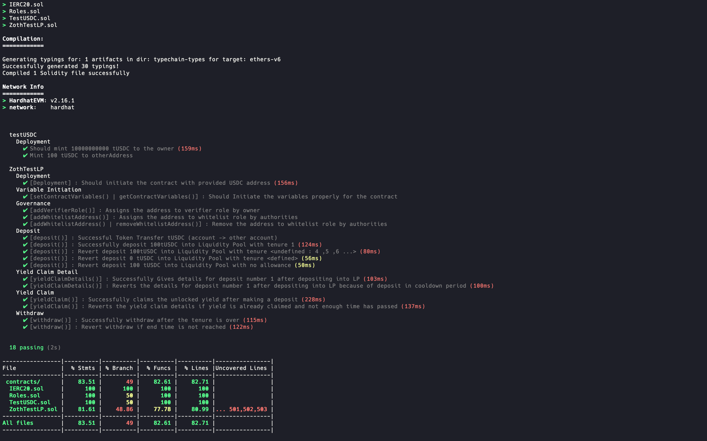
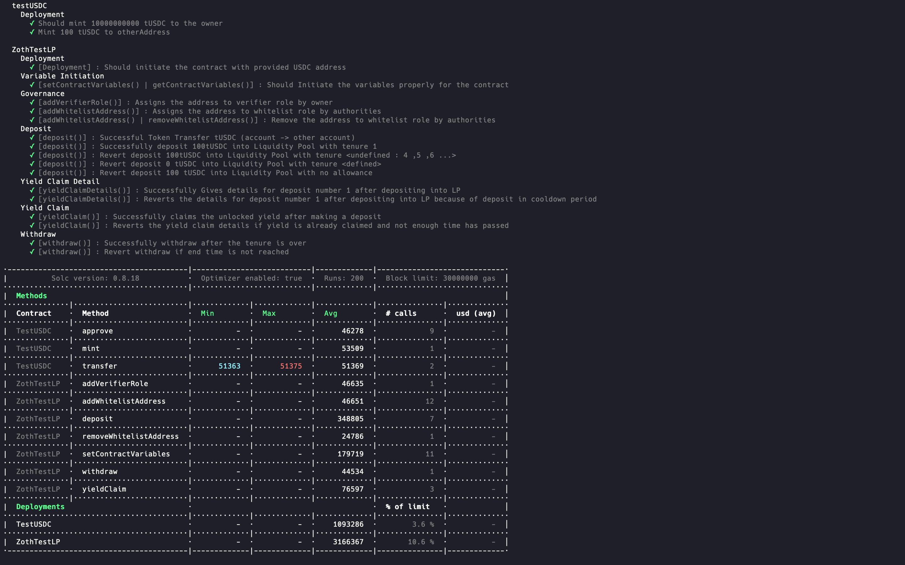

# Zoth Contracts

This repo contains the EVM-comaptible smart contracts representing the Lending Pools.

Run :

- This will compile, test and analyse all the test cases and will generate a coverge report.

```sh
yarn hardhat coverage
```

</img>

- This will generate the gas report of the functions that are to be executed on the blockchain.

```sh
REPORT_GAS=true npx hardhat test
```

</img>
